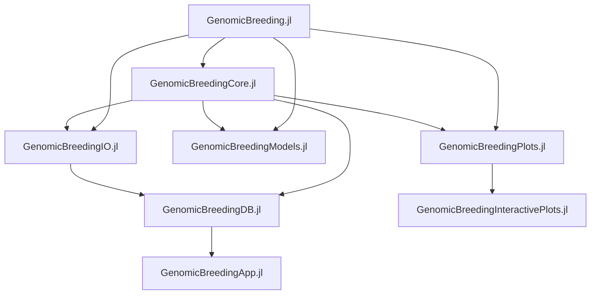

# GenomicBreeding

This organisation develops a genomic breeding pipeline in Julia covering data I/O, modelling, visualisation, and application layers. Current capabilities include genomic prediction assessment (e.g., repeated k-fold CV) and allele effect extraction; GWAS, mating/crossing designs, breeding simulations, and high-dimensional selection indices are under development.

## Repositories and Roles

|Library|Description|Status|Docs|
|:-----|:-----|:-----|:-----|
| [GenomicBreeding.jl](https://github.com/GenomicBreeding/GenomicBreeding.jl) | Orchestrates the entire genomic breeding workflow (pipelines, and integration across modules) |  |  |
| [GenomicBreedingCore.jl](https://github.com/GenomicBreeding/GenomicBreedingCore.jl) | Core data structures, utilities, and shared abstractions |  |  |
| [GenomicBreedingIO.jl](https://github.com/GenomicBreeding/GenomicBreedingIO.jl) | Data input and output |  |  |
| [GenomicBreedingModels.jl](https://github.com/GenomicBreeding/GenomicBreedingModels.jl) | Genomic prediction models |  |  |
| [GenomicBreedingPlots.jl](https://github.com/GenomicBreeding/GenomicBreedingPlots.jl) | Static plotting functions |  |  |
| [GenomicBreedingDB.jl](https://github.com/GenomicBreeding/GenomicBreedingDB.jl) | Database connectivity and persistence for genotypes/phenotypes, results, and metadata |  |  |
| [GenomicBreedingApp.jl](https://github.com/GenomicBreeding/GenomicBreedingApp.jl) | User-facing application layer that surfaces workflows and visualisations |  |  |
| [GenomicBreedingInteractivePlots.jl](https://github.com/GenomicBreeding/GenomicBreedingInteractivePlots.jl) | Interactive visualisations for dynamic exploration of results |  |  |

## Mermaid: Architecture Map

## Milestone Plan (Draft)

### Milestone 1: Stabilise Core & Modelling
- **Core:** finalise data structures for genotypes/phenotypes; define common interfaces.
- **Models:** complete repeated k-fold CV, allele effect extraction; add benchmarking harness.
- **IO:** standardise loaders (VCF, CSV/TSV, JLD2) and schema validation.
- **Plots:** deliver model evaluation plots (CV metrics, residuals, feature importance).
- **.github:** CI for Julia versions, unit tests, and documentation builds.

### Milestone 2: GWAS Foundations
- **Models:** implement GWAS pipeline (linear/mixed models), p-value correction, Manhattan/Q-Q plots.
- **IO/DB:** support GWAS input tables and result storage; indexing for fast retrieval.
- **InteractivePlots:** interactive Manhattan/QQ with hover details and region zoom.
- **Workflow:** end-to-end GWAS run configuration and reproducible reports.

### Milestone 3: Mating/Crossing Designs
- **Models/Core:** utilities for mating plans (e.g., optimal contribution, diversity constraints).
- **App:** UI for proposing/validating crossing designs; export to breeding operations.
- **Plots:** pedigree and cross outcome visualisation.

### Milestone 4: Breeding Simulations
- **Models:** stochastic/forward simulations with selection strategies; track genetic gain and inbreeding.
- **DB:** store simulation scenarios and outcomes; comparison dashboards.
- **InteractivePlots:** time-series and scenario comparison widgets.

### Milestone 5: High-dimensional Selection Indices
- **Models:** multi-trait indices (economic weights, sparsity/regularisation); sensitivity analyses.
- **Workflow/App:** templated runs and interactive tuning.

