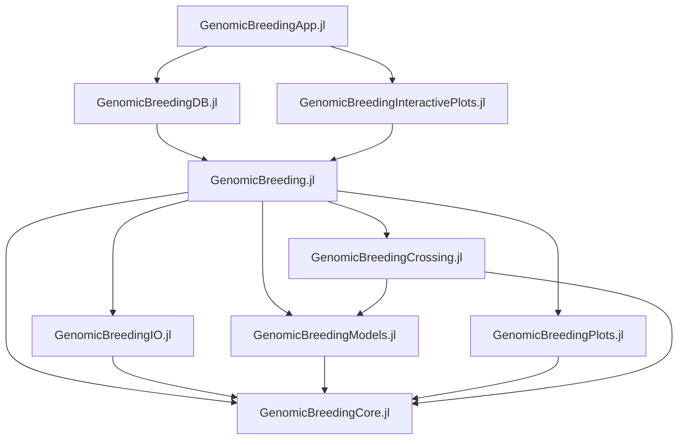

# GenomicBreeding

This organisation develops a genomic breeding pipeline in Julia covering data structure, I/O, modelling, visualisation, and application layers. Current capabilities include genomic prediction assessment (e.g. repeated k-fold CV) and allele effect extraction. GWAS, mating/crossing designs, breeding simulations, and high-dimensional selection indices are under development.

## Repositories

|Library|Description|Status|Docs|
|:-----|:-----|:-----|:-----|
| [GenomicBreeding.jl](https://github.com/GenomicBreeding/GenomicBreeding.jl) | Orchestrates the entire genomic breeding workflow (pipelines, and integration across modules) |  |  |
| [GenomicBreedingCore.jl](https://github.com/GenomicBreeding/GenomicBreedingCore.jl) | Core data structures, utilities, and shared abstractions |  |  |
| [GenomicBreedingIO.jl](https://github.com/GenomicBreeding/GenomicBreedingIO.jl) | Data input and output |  |  |
| [GenomicBreedingModels.jl](https://github.com/GenomicBreeding/GenomicBreedingModels.jl) | Genomic prediction models |  |  |
| [GenomicBreedingCrossing.jl](https://github.com/GenomicBreeding/GenomicBreedingCrossing.jl) | Cross/mating designs and breeding simulations |  |  |
| [GenomicBreedingPlots.jl](https://github.com/GenomicBreeding/GenomicBreedingPlots.jl) | Static plotting functions |  |  |
| [GenomicBreedingDB.jl](https://github.com/GenomicBreeding/GenomicBreedingDB.jl) | Database connectivity and persistence for genotypes/phenotypes, results, and metadata |  |  |
| [GenomicBreedingApp.jl](https://github.com/GenomicBreeding/GenomicBreedingApp.jl) | User-facing application layer that surfaces workflows and visualisations |  |  |
| [GenomicBreedingInteractivePlots.jl](https://github.com/GenomicBreeding/GenomicBreedingInteractivePlots.jl) | Interactive visualisations for dynamic exploration of results |  |  |

## Architecture Map

- [ ] Add `GenomicBreedingCrossing.jl` once we have a fully drafted/minimum working module built.

```mermaid
flowchart TB
    Workflow[GenomicBreeding.jl] --> Core[GenomicBreedingCore.jl]
    Workflow --> IO[GenomicBreedingIO.jl]
    Workflow --> Models[GenomicBreedingModels.jl]
    Workflow --> Plots[GenomicBreedingPlots.jl]
    Workflow --> Cross[GenomicBreedingCrossing.jl]
    IO --> Core
    Models --> Core
    Plots --> Core
    Cross --> Core
    Cross --> Models
    DB[GenomicBreedingDB.jl] --> Workflow
    IPlots[GenomicBreedingInteractivePlots.jl] --> Workflow
    App[GenomicBreedingApp.jl] --> DB
    App --> IPlots
```

## Milestone Plan

### Milestone 1: Stabilise Core & Modelling
- **Core**: data structures for genotypes/phenotypes are well-drafted; finalise common interfaces.
- **Models**: repeated k-fold CV and allele effect extraction are complete; plan migration from R::BGLR to Julia using Turing.jl (pending faster estimations for large parameter sets); add benchmarking harness.
- **IO**: loaders (VCF, CSV/TSV, JLD2) and schema validation are well-drafted.
- **Plots**: deliver model evaluation plots (CV metrics, residuals, feature importance); improve overall plotting capabilities.
- **.github**: CI for Julia versions, unit tests, and documentation builds.

### Milestone 2: GWAS Foundations
- **Models**: implement GWAS pipeline (linear/mixed models), add more GWAS models, p-value correction, Manhattan/Q-Q plots; improve tests.
- **IO/DB**: support GWAS input tables and result storage; indexing for fast retrieval; revise DB to use SearchLight.jl instead of raw SQL.
- **App**: interactive Manhattan/QQ with hover details and region zoom (migrated from InteractivePlots).
- **Workflow**: end-to-end GWAS run configuration and reproducible reports.

### Milestone 3: Mating/Crossing Designs
- **Crossing**: utilities for mating plans (e.g., optimal contribution, diversity constraints); fully draft Crossing module.
- **App**: UI for proposing/validating crossing designs; export to breeding operations; refactor App for better integration.
- **Plots**: pedigree and cross outcome visualisation; improve plotting functions.

### Milestone 4: Breeding Simulations
- **Crossing**: stochastic/forward simulations with selection strategies; track genetic gain and inbreeding.
- **DB**: store simulation scenarios and outcomes; comparison dashboards; use SearchLight.jl.
- **App**: time-series and scenario comparison widgets (migrated from InteractivePlots); refactor App.

### Milestone 5: High-dimensional Selection Indices
- **Models**: multi-trait indices (economic weights, sparsity/regularisation); sensitivity analyses.
- **Workflow/App**: templated runs and interactive tuning; refactor App for comprehensive functionality.

